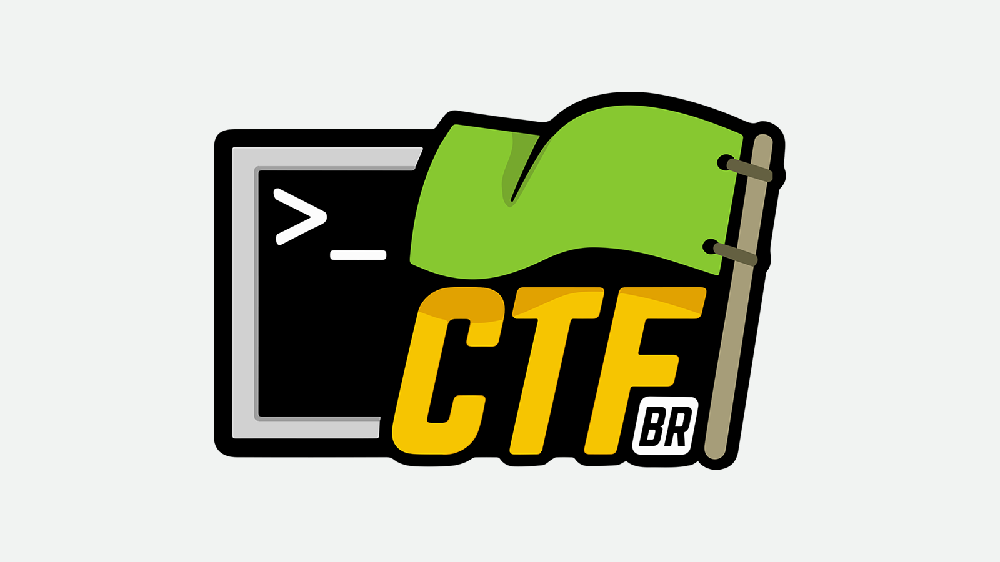
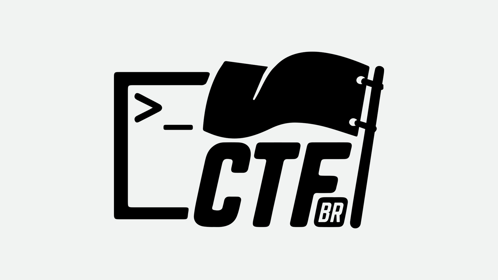
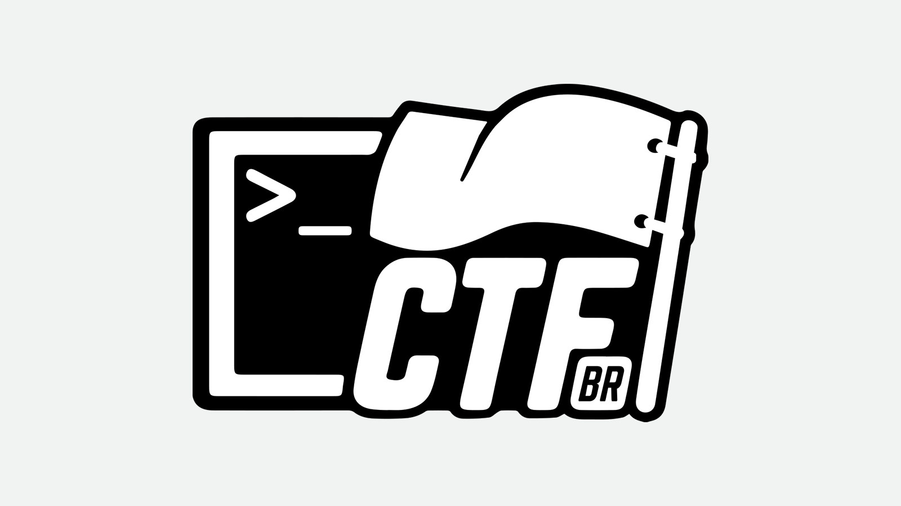
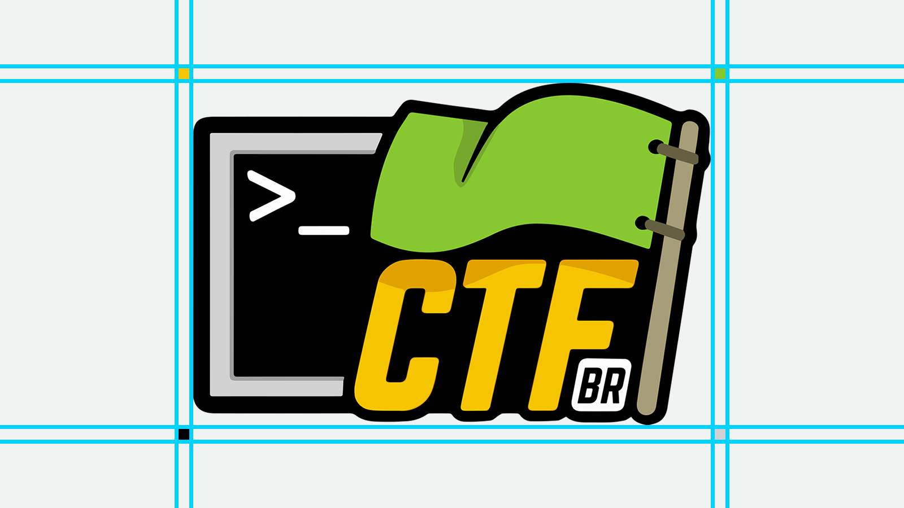

[](https://www.twitter.com/thezakman)

<!-- 

. . . . . . . . . . . . . . . . . . . . . . . . . . . . . . . . . . . . . . . . . . . . . . . .
.                                                                                             .
.                                                           .-:/++oooo++/::-..                .
.                                      .....             ./osssssssssssssssssso+/-.           .
.                                     /ssssssso++/::-. -+sssssssssssssssssssssssssss+/. -:.   .
.  .//////////////////////////////.  +sssssssssssooo:.+sssssssssssssssssssssssssssssss .sss   .
.  .dddddddddddddddddddddddddddddh. +ssssssssssssoo:.ossssssssssssssssssssssssssss-./+.:ss+   .
.  .dddh/////////////////////////. /ssssssssssssoo/-osssssssssssssssssssssssssssss+/o:://+:   .
.  .dddh. ..                      .ssssssssssssso+-ssssssssssssssssssssssssssssssssss .sso.   .
.  .dddh. :dho:.                  ossssssssssssso:ssssssssssssssssssssssssssssssssss/ :sso    .
.  .dddh.  .:ohdh+-              -ssssssssssssssssssssssssssssssssssssssssssssssssss. oss:    .
.  .dddh.    .:oNNy              +ssssssssssssssssssssssssssssssssssssssssssssssssss .sss.    .
.  .dddh.  +ydhs:..             .ssssssssssssssssssssssssssssssssssssssssssssssssss/ -sso     .
.  .dddh.  o/..     .........   -sssssssssssssssssssssssssoo+++++ooossssssssssso.-+:./ss:     .
.  .dddh.          -yyyyyyyy/   :sssssssssssssssssssso+:....     ......-/+oossss+o+-:+++.     .
.  .dddh.                       ..:+oosssssssssso+/-..                     ..-:/+o: -ss+.     .
.  .dddh.                           ..--:::::-... ..............   ............. .  +ss/      .
.  .dddh.                          -+oosssssoo/. -ossssssssssss+  osssssssssssso.   sss.      .
.  .dddh.                        .+yyyyyyyyyyyy+ +yyyyhhhhhhhhh: -hhhhhhhhyyyyyo   -sss       .
.  .dddh.                        /hhyys///syyyy/ //++hhhhho+++/  ohhhhs+++++++/.   +ss+       .
.  .dddh.                        yhhhh:  .yhhhh.    .hhhhh.     .hhhhh.            sss-       .
.  .dddh.                       :hhhhy   .ssss+     ohhhh+      +hhhho            -sss.       .
.  .dddh.                       shhhh/             .hhhhh.     .hhhhho/////-      +sso        .
.  .dddh.                      -hhhhh.             /hhhhs      /hhhhhhhhhhh+      sss:        .
.  .dddh.                      ohhhh+             .yhhhh:      yhhhhyyyyyyy.     -sss.        .
.  .dddh.                     .hhhhh.   .....     :hhhhy      :hhhhy..----.....  +sso         .
.  .dddh                      +hhhhs   +hhhh/     shhhh/      shhhh/ /mhhmmhhdd  sss/         .
.  .dddh/::::::::::::::::::- .yhhhh:...hhhhh.    -hhhhy.     .hhhhh. d+:::::::h -sss.         .
.  .dddddddddddddddddddddddo :hhhhhyyyhhhhh+     ohhhh+      ohhhh+ -N:::BR::y/ /sss          .
.  .:::::::::::::::::::::::. .yhhhhhhhhhhh+.    .hhhhh.     .hhhhh. sy:::::::N. oss+          .
.                             .:++++++++:.      .+o++/      .++++/  :yyyhyyyy:  +ss.          .
.                                                                                             .
. . . . . . . . . . . . . . . . . . . . . . . . . . . . . . . . . . . . . . . . . . . . . . . .
	  
-->

# CTF-BR - Branding

Repositório com todo o material gráfico do projeto [CTF-BR](https://ctf-br.org)
----------------

Por favor, consulte esse repositório para mais informações sobre os itens mostrados a seguir.

O logo do CTF-BR usado como assinatura em todas as nossas comunicações. Gostaríamos que ele fosse instantaneamente reconhecível, então a consistência é importante. Não o edite, altere, distorça, repinte ou reconfigure.




Por favor, use nosso logo de duas cores na maioria dos casos. Em circunstâncias especiais utilize a marca nominal em preto sólido ou branco e preto. 







Certifique-se de que o logo esteja corretamente espaçado.




``` r
Qualquer dúvida só entrar em contato comigo @TheZakMan
```

PS: se possivel lembrem de dar créditos ao amigo aqui que fez tudo isso :)


